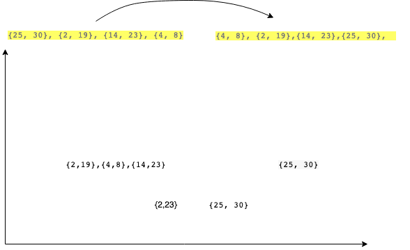

# Daimler Merge

](https://gitlab.com/mschlech/daimler_merge)


Implementation of a MERGE Function which takes a list of intervals which returns a list of all non overlapping intervalls subsequently.

example:
Input: [25,30] [2,19] [14, 23] [4,8]  Output: [2,23] [25,30]

Runtime of the implementation ? 
How can a robustness of the implmentation being fullfilled of huge amount of incoming lists ?
Memory consumption ?

## Time complexity and resulting computational drawbacks

The interval to be found is the result of comparing 2 values. The first one of a tuple and the second one. The first one is the offset in the code and the second one the end. The notation may be misleading.
One complexity is the O(n2) which can be optimized by sorting which results in a O(logn) situation.




# build and start the docker container 

## build the container. 
You can build for the following platforms your container :

- linux/amd64 
-  linux/arm 
-  linux/arm64 
-  linux/ppc64le 
-  linux/s390x 
-  windows/amd64

for testing purposes only the linux/amd64 is build. If you like to build all the mentioned container, please uncomment line 18 and delete line 19 in the *Makefile*

## start the container
After the build is finished you can start the container as follows

fetch the container names with docker images and choose a container

docker run -t -i -p 4000:4000 -ti --rm --init <containerName>


## run inside the ide.
Within the Jetbrains golang IDE you can click on the play symbol  
within your IDE and run the Main Method 
You can invoke the following url from your browser.

http://localhost:4000/mergedlist


## deployment 
Further deployment information for a Kubernetes Deployment resides in the *kubernetes* directory in root of this repo.

## monitoring 

### initial setup 
Install a grafana docker container upfront.

```docker run -d -p 3000:3000 --name grafana grafana/grafana:6.5.0```

there is a simple beginning approach using prometheus.
You can call the http://localhost:4000/mergedlist to invoke the functional REST Endpoint to request a mergedlist
After this call you can invoke http://localhost:4000/metrics to optain prometheus results. You get a list of prometheus metrics

You should find the registered mehtod and resulting metrics
```bazaar
....

# HELP http_request_get_metrics_of_merge_duration_seconds get the latency of a merge operation merging intervals
# TYPE http_request_get_metrics_of_merge_duration_seconds histogram
http_request_get_metrics_of_merge_duration_seconds_bucket{status="",le="0.01"} 1
http_request_get_metrics_of_merge_duration_seconds_bucket{status="",le="0.060000000000000005"} 1
http_request_get_metrics_of_merge_duration_seconds_bucket{status="",le="0.11000000000000001"} 1
http_request_get_metrics_of_merge_duration_seconds_bucket{status="",le="0.16000000000000003"} 1
http_request_get_metrics_of_merge_duration_seconds_bucket{status="",le="0.21000000000000002"} 1
http_request_get_metrics_of_merge_duration_seconds_bucket{status="",le="0.26"} 1
http_request_get_metrics_of_merge_duration_seconds_bucket{status="",le="0.31"} 1
http_request_get_metrics_of_merge_duration_seconds_bucket{status="",le="0.36"} 1
http_request_get_metrics_of_merge_duration_seconds_bucket{status="",le="0.41"} 1
http_request_get_metrics_of_merge_duration_seconds_bucket{status="",le="0.45999999999999996"} 1
http_request_get_metrics_of_merge_duration_seconds_bucket{status="",le="+Inf"} 1
http_request_get_metrics_of_merge_duration_seconds_sum{status=""} 0.000257947
http_request_get_metrics_of_merge_duration_seconds_count{status=""} 1

....

```


# TODO 
to finish 
- kubernetes deployment, healtcheck and readiness 
- monitoring with grafana and prometheus
- deployment & integration ( infrastructre e.g with terraform , rest with helm)
- finalize tests
- load tests , E2E 
nice to have not finished > one endpoint for random intervals of configurable size to measure the performance
  - run script as simple wrapper and start to simplify the make all-container , docker run command